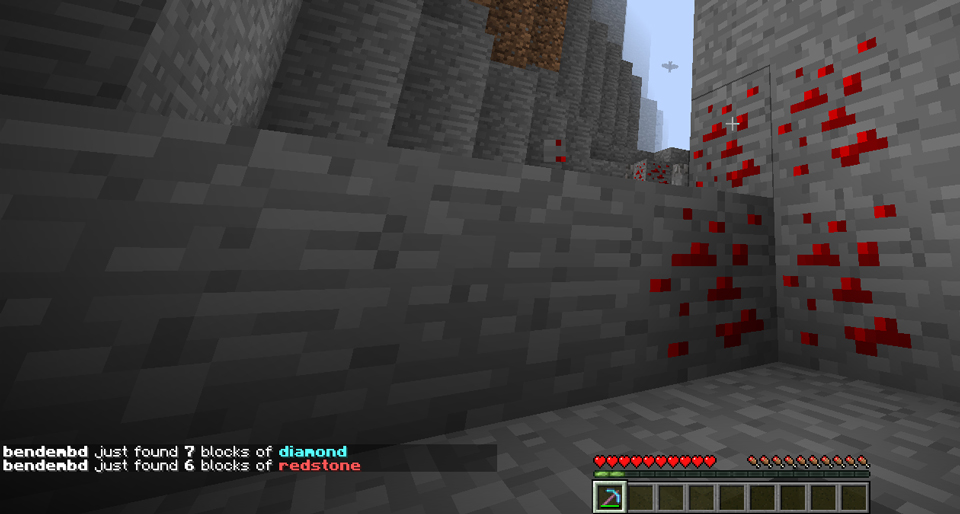

# OreBroadcast

## English

### Description

Broadcast a message to the server when you find ores.

### Commands

+ /ob reload : Reload config from file

### Download

Automatic builds are available here : [https://drone.io/github.com/bendem/OreBroadcast/files](https://drone.io/github.com/bendem/OreBroadcast/files)

## Français

### Description

Broadcast un message à tout le serveur quand vous trouvez des minerais.

### Commandes

+ /ob reload : Recharge la config depuis le fichier

### Téléchargement

Les builds seront disponible ici : [https://drone.io/github.com/bendem/OreBroadcast/files](https://drone.io/github.com/bendem/OreBroadcast/files)

